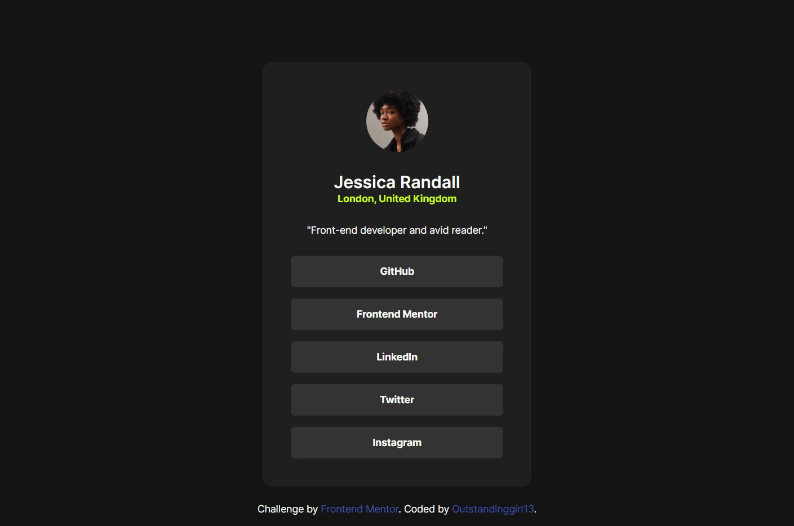

# Frontend Mentor - Social links profile solution

This is a solution to the [Social links profile challenge on Frontend Mentor](https://www.frontendmentor.io/challenges/social-links-profile-UG32l9m6dQ). Frontend Mentor challenges help you improve your coding skills by building realistic projects. 

## Table of contents

- [Overview](#overview)
  - [The challenge](#the-challenge)
  - [Screenshot](#screenshot)
  - [Links](#links)
- [My process](#my-process)
  - [Built with](#built-with)
  - [What I learned](#what-i-learned)
- [Author](#author)

## Overview

### The challenge

Users should be able to:

- See hover and focus states for all interactive elements on the page

### Screenshot



### Links

- Solution URL: [Add solution URL here](https://your-solution-url.com)
- Live Site URL: [GitHub Pages](https://outstandinggirl13.github.io/social-links-profile-main/)

## My process

### Built with

- Semantic HTML5 markup
- CSS custom properties
- Flexbox
- Mobile-first workflow

### What I learned

I learned how to use the ```clamp()``` function to make elements responsive.
In this project, I used it on the ```.card__link elements``` so they smoothly expand and shrink across different screen sizes - which also affects the overall width of the ```.card``` component:

```CSS
.card__link {
  width: clamp(12.5rem, 75vw, 18.875rem);
}
```

## Author

- Website - [Outstandinggirl13](https://github.com/Outstandinggirl13)
- Frontend Mentor - [@Outstandinggirl13](https://www.frontendmentor.io/profile/Outstandinggirl13)
